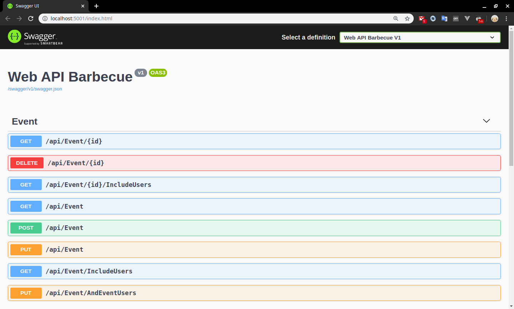

# ProjectBarbecue
Projeto de uma Web API com o intuito de gerenciar eventos de churrasco. Utilizando .Net Core

* Swagger


Para rodar o projeto é necessário:
-----------
* .net core 3.0
* Node
* Sql Server Express
* Ajustar a connectionstring no arquivo app.settings do projeto Barbecue.WebAPI (banco rordando local)

* Executar os comando a seguir no terminal dentro da pasta raíz do projeto.

* Restaura os pacotes NPM e dar Build nos projetos, executando o comando abaixo:
```
dotnet build
```
* Criar a Base de Dados executando o comando abaico:
```
dotnet ef database update -p src/Barbecue.Infrastructure/ -s src/Barbecue.WebAPI/ -v
```
* Rodar projeto executando o comando abaixo:
```
dotnet run -p src/Barbecue.WebAPI/ -v
```
* Após isso, abrir a url [http://localhost:5000](http://localhost:5000) no navegador de sua preferência.

* Projeto inclui:
  - .Net Core
  - Sql Server
  - Entity Framework Core
  - Swagger
